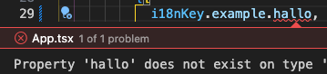
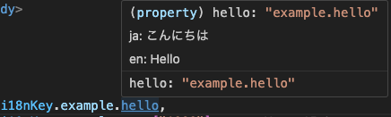

# 🫱‍🫲 i18next-ts-bond 🫱‍🫲

**i18next-ts-bond** is a Vite plugin and CLI tool that automatically generates type-safe TypeScript constants from your i18next translation JSON files. It merges translation keys from multiple languages into a single, type-checked object and adds helpful comments that display the translations for each language.

## Installation

Install the package as a development dependency:

```bash
npm install --save-dev i18next-ts-bond
# or
yarn add --dev i18next-ts-bond
```

## Usage

### As a Vite Plugin

Add i18next-ts-bond to your vite.config.ts:

```typescript
import { defineConfig } from "vite";
import i18nextTsBondVitePlugin from "i18next-ts-bond/vite-plugin";

export default defineConfig({
  plugins: [
    i18nextTsBondVitePlugin({
      localesDir: "./locales", // Directory containing translation JSON files
      outputFile: "./src/i18nKey.ts", // Output file for generated TS constants
      languages: ["ja", "en"], // List of language codes to process
      namespace: "common", // (Optional) Namespace to extract from translations
    }),
  ],
});
```

### Using the CLI Tool

After installing the package, you can run the CLI via npx:

#### Generate Once

```bash
npx i18next-ts-bond --localesDir ./src/locales --outputFile ./src/i18nKey.ts --languages ja,en
```

#### Watch Mode

```bash
npx i18next-ts-bond --watch --localesDir ./src/locales --outputFile ./src/i18nKey.ts --languages ja,en
```

#### CLI Options

- `--localesDir, -l`: (Required) The directory containing your translation JSON files (e.g., ./locales).
- `--outputFile, -o`: (Required) The output path for the generated TypeScript file (e.g., ./src/i18nKey.ts).
- `--languages, -L`: (Required) A comma-separated list of language codes (e.g., ja,en).
- `--namespace, -n`: (Optional) The target namespace within the translation files.
- `--watch, -w`: (Optional) Enable watch mode to automatically regenerate the file when translations change.

## Example

### Input Files

#### ja.json

```json
{
  "common": {
    "hello": "こんにちは",
    "goodbye": "さようなら"
  }
}
```

#### en.json

```json
{
  "common": {
    "hello": "Hello",
    "goodbye": "Goodbye"
  }
}
```

### Output File

```typescript
/*
 * This file is automatically generated.
 * Manual modifications may be overwritten.
 */
const i18nKey = {
  common: {
    /**
     * ja: こんにちは
     *
     * en: Hello
     */
    hello: "common.hello",
    /**
     * ja: さようなら
     *
     * en: Goodbye
     */
    goodbye: "common.goodbye",
  },
} as const;

export default i18nKey;
```

## Motivation

- **Avoid Mistakes in i18n Keys:** Generate type-safe constants to minimize typos and mistakes in your translation keys.



- **Immediate Visibility of Displayed Text:** Quickly see the actual text that will be displayed by hovering over keys in your editor.



## License

MIT
